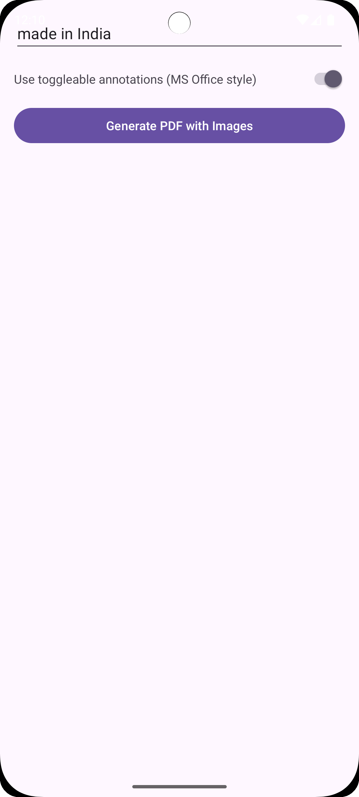
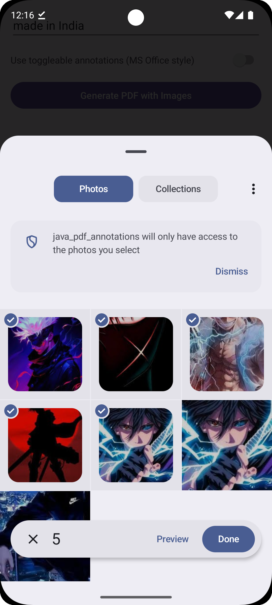

  <h1><strong>Android PDF Annotations</strong></h1>

  
A modern Android application that allows users to add annotations to PDF documents, with support for both standard and toggleable annotations.

   

  
  
  
   
   

<h2>Features</h2>

<ul>
  <li><strong>Image Selection</strong>
    <ul>
      <li>Select images from your device to use as annotations</li>
      <li>Preview selected images before adding them to PDFs</li>
    </ul>
  </li>
  
  <li><strong>Standard Annotations</strong>
    <ul>
      <li>Embed images directly into PDF documents</li>
      <li>Permanent visual annotations that are always visible</li>
    </ul>
  </li>
  
  <li><strong>Toggleable Annotations</strong>
    <ul>
      <li>Microsoft Office-style comments that can be toggled open and closed</li>
      <li>Interactive annotations that provide a cleaner document view</li>
    </ul>
  </li>
</ul>

<h2>Screenshots</h2>

<table>
  <tr>
    <td></td>
    <td></td>
    <td></td>
    <td></td>
  </tr>
  <tr>
    <td>Home Screen</td>
    <td>Image Selection</td>
    <td>Standard Annotations</td>
    <td>Toggleable Annotations</td>
  </tr>
</table>

<h2>Tech Stack</h2>

<ul>
  <li><strong>Android Development</strong>
    <ul>
      <li>Java as primary language</li>
      <li>Android SDK</li>
      <li>Material Components</li>
      <li>Minimum SDK 24 (Android 7.0+)</li>
    </ul>
  </li>
  
  <li><strong>PDF Processing</strong>
    <ul>
      <li>PDFBox Android for PDF manipulation</li>
      <li>Custom annotation rendering</li>
    </ul>
  </li>
  
  <li><strong>Key Libraries</strong>
    <ul>
      <li>Coil for image loading</li>
      <li>AndroidX components</li>
    </ul>
  </li>
</ul>

<h2>Getting Started</h2>

<h3>Prerequisites</h3>

<ul>
  <li>Android Studio</li>
  <li>JDK 17</li>
  <li>Android SDK 35</li>
  <li>Gradle 8.0+</li>
</ul>

<h3>Installation</h3>

<ol>
  <li>Clone the repository:
    <pre><code>git clone https://github.com/yourusername/android_java_pdf_annotations.git</code></pre>
  </li>
  <li>Open project in Android Studio</li>
  <li>Build and run the project on an emulator or physical device</li>
</ol>

<h2>Architecture</h2>

The app follows a clean architecture approach with separation of concerns:

<ul>
  <li>Presentation layer for UI components</li>
  <li>Domain layer for business logic</li>
  <li>Data layer for data access and storage</li>
</ul>

<h2>Contributing</h2>

<ol>
  <li>Fork the repository</li>
  <li>Create your feature branch (<code>git checkout -b feature/AmazingFeature</code>)</li>
  <li>Commit your changes (<code>git commit -m 'Add some AmazingFeature'</code>)</li>
  <li>Push to the branch (<code>git push origin feature/AmazingFeature</code>)</li>
  <li>Open a Pull Request</li>
</ol>

<h2>License</h2>

  <pre>
  GNU AFFERO GENERAL PUBLIC LICENSE
  Version 3, 19 November 2007

  This project is licensed under the AGPL-3.0 License - see the LICENSE file for details.
  </pre>

